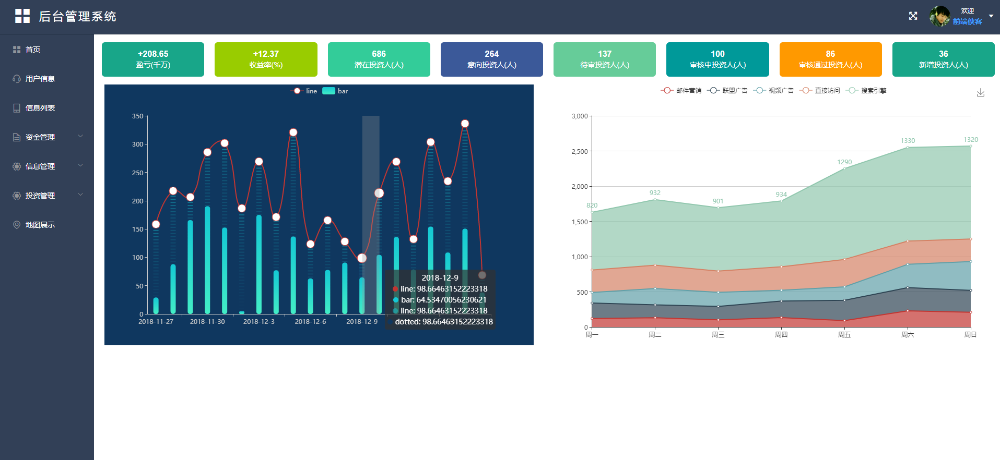
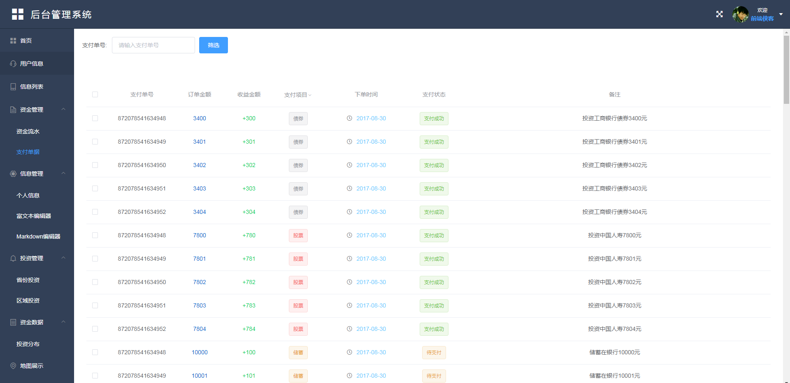
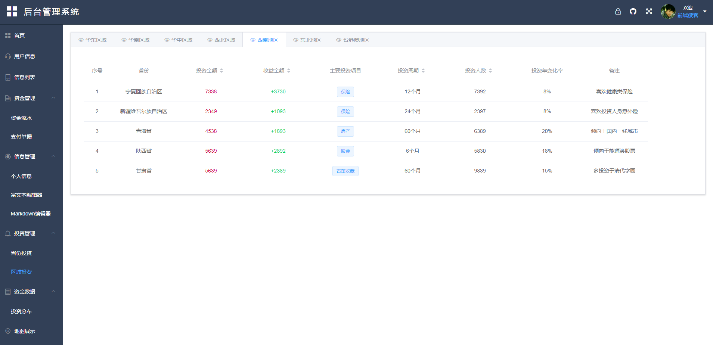
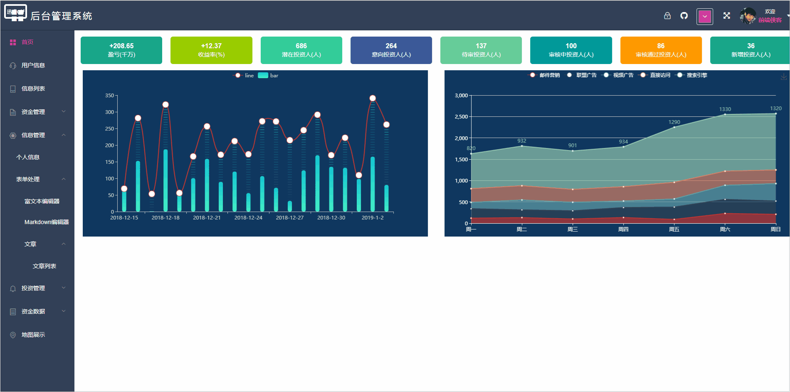

# 基于vue3.0实现后台管理模板

> 通过自己所学的vue知识，从0开始自己搭建的一个关于后台管理的模板界面，有时间就会更新新的内容，实现一些常用的功能，
> 使用vue最新脚手架搭建环境，编写界面，使用axios请求接口，渲染界面,实现页面登录注册，数据的增删改查,数据部分存储到easy-mock数据中。

## 项目结构
```
  |——— client  #vue项目入口文件
	|——— config  #秘钥配置文件
	|——— node_modules #一些常用安装的依赖
	|——— models #接口模型
	|——— router       #接口文档
	|——— package.json #项目配置文件
	|___ README.md    #项目的说明文档，markdown 格式
```
## 相关技术
	1. vuejs2.0：一套构建用户界面的渐进式框架，易用、灵活、高效。
	2. vue-router：官方的路由组件，配合vue.js创建单页应用（SPA）非常简单。
	3. axios: 基于 Promise 的 HTTP 请求客户端，可同时在浏览器和 node.js 中使用。
	
## 功能介绍
	- Element-ui
	- 请求拦截和响应拦截
	- 富文本编辑器
	- Markdown编辑器
	- Echarts
	- tab数据切换
	- token本地存储
	- 表单
	- 高德地图引入
	- 登录注册
	- 路由守卫
	- vuex存储
	- 数据分页和查询
	- Excel表格导出
	- 递归组件
	- 主题更换
	- 404

## 项目编译和运行
  + 可以直接在git上下载项目源码。把github下载到本地，
		git clone [](https://github.com/MrZHLF/vue-admin.git)
	+ 进入node-api-element当前页面初始化
		cnpm install
	+ 进入client项目目录中
		cnpm install
  + 所有依赖安装成功后执行启动命令在当前目录启动,不要在client进行启动，已经配置好前后端联调
	  npm run dev 
	  如果显示一下内容说明安装成功
	  I  Your application is running here: http://localhost:8080
		
## 成果展示
 
 
 
 
 
更新中...